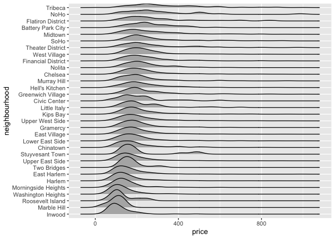

10.10 case study
================
Yuqing Liu
2023-10-10

``` r
library(p8105.datasets)

data(nyc_airbnb)
```

``` r
# View(nyc_airbnb)
str(nyc_airbnb)
```

    ## spc_tbl_ [40,753 × 17] (S3: spec_tbl_df/tbl_df/tbl/data.frame)
    ##  $ id                            : num [1:40753] 7949480 16042478 1886820 6627449 5557381 ...
    ##  $ review_scores_location        : num [1:40753] 10 NA NA 10 10 10 10 9 10 9 ...
    ##  $ name                          : chr [1:40753] "City Island Sanctuary relaxing BR & Bath w Parking" "WATERFRONT STUDIO APARTMENT" "Quaint City Island Community." "Large 1 BDRM in Great location" ...
    ##  $ host_id                       : num [1:40753] 119445 9117975 9815788 13886510 28811542 ...
    ##  $ host_name                     : chr [1:40753] "Linda & Didier" "Collins" "Steve" "Arlene" ...
    ##  $ neighbourhood_group           : chr [1:40753] "Bronx" "Bronx" "Bronx" "Bronx" ...
    ##  $ neighbourhood                 : chr [1:40753] "City Island" "City Island" "City Island" "City Island" ...
    ##  $ lat                           : num [1:40753] -73.8 -73.8 -73.8 -73.8 -73.8 ...
    ##  $ long                          : num [1:40753] 40.9 40.9 40.8 40.8 40.9 ...
    ##  $ room_type                     : chr [1:40753] "Private room" "Private room" "Entire home/apt" "Entire home/apt" ...
    ##  $ price                         : num [1:40753] 99 200 300 125 69 125 85 39 95 125 ...
    ##  $ minimum_nights                : num [1:40753] 1 7 7 3 3 2 1 2 3 2 ...
    ##  $ number_of_reviews             : num [1:40753] 25 0 0 12 86 41 74 114 5 206 ...
    ##  $ last_review                   : Date[1:40753], format: "2017-04-23" NA ...
    ##  $ reviews_per_month             : num [1:40753] 1.59 NA NA 0.54 3.63 2.48 5.43 2.06 5 2.98 ...
    ##  $ calculated_host_listings_count: num [1:40753] 1 1 1 1 1 1 1 4 3 4 ...
    ##  $ availability_365              : num [1:40753] 170 180 365 335 352 129 306 306 144 106 ...

``` r
nyc_airbnb |>
  count(room_type)
```

    ## # A tibble: 3 × 2
    ##   room_type           n
    ##   <chr>           <int>
    ## 1 Entire home/apt 19937
    ## 2 Private room    19626
    ## 3 Shared room      1190

``` r
nyc_airbnb |>
  count(neighbourhood_group)
```

    ## # A tibble: 5 × 2
    ##   neighbourhood_group     n
    ##   <chr>               <int>
    ## 1 Bronx                 649
    ## 2 Brooklyn            16810
    ## 3 Manhattan           19212
    ## 4 Queens               3821
    ## 5 Staten Island         261

## Brainstorm questions

- Where are Airbnbs expensive?
  - Borogh? Neighborhood?
  - Do other factors affect price? What about rating?

``` r
nyc_airbnb |> group_by(review_scores_location)|>
  summarize(
    mean_price = mean(price, na.rm = TRUE),
    mean_price = mean(price, na.rm = TRUE),
    median_price = median(price),
    sd_tmax = sd(price))
```

    ## # A tibble: 10 × 4
    ##    review_scores_location mean_price median_price sd_tmax
    ##                     <dbl>      <dbl>        <dbl>   <dbl>
    ##  1                      2       98           63      71.8
    ##  2                      3       62.5         62.5    17.7
    ##  3                      4       92.4         70      59.6
    ##  4                      5      106.          80      92.0
    ##  5                      6       98.9         66     102. 
    ##  6                      7      102.          75      88.0
    ##  7                      8      112.          80     277. 
    ##  8                      9      120.          90     156. 
    ##  9                     10      158.         125     180. 
    ## 10                     NA      159.         100     274.

``` r
nyc_airbnb |> group_by(neighbourhood_group, room_type)|>
  summarize(
    median_price = median(price))|>
    pivot_wider(names_from = room_type,
                values_from = median_price)
```

    ## `summarise()` has grouped output by 'neighbourhood_group'. You can override
    ## using the `.groups` argument.

    ## # A tibble: 5 × 4
    ## # Groups:   neighbourhood_group [5]
    ##   neighbourhood_group `Entire home/apt` `Private room` `Shared room`
    ##   <chr>                           <dbl>          <dbl>         <dbl>
    ## 1 Bronx                            100              55            43
    ## 2 Brooklyn                         145              65            40
    ## 3 Manhattan                        190              90            65
    ## 4 Queens                           119              60            39
    ## 5 Staten Island                    112.             55            25

``` r
nyc_airbnb |> 
  filter(
    price<1000,
    room_type == "Entire home/apt",
    neighbourhood_group == "Manhattan")|>
  group_by(neighbourhood)|>
  summarize(
    n_apt = n(),
    mean_price = mean(price))|>
  arrange((mean_price)) # sort mean_price
```

    ## # A tibble: 32 × 3
    ##    neighbourhood       n_apt mean_price
    ##    <chr>               <int>      <dbl>
    ##  1 Marble Hill             6       101.
    ##  2 Inwood                 88       119.
    ##  3 Roosevelt Island        8       131.
    ##  4 Washington Heights    260       133.
    ##  5 Morningside Heights   157       151.
    ##  6 East Harlem           431       163.
    ##  7 Harlem                964       164.
    ##  8 Two Bridges            21       174.
    ##  9 Upper East Side      1001       193.
    ## 10 Lower East Side       522       205.
    ## # ℹ 22 more rows

``` r
nyc_airbnb |> 
  filter(
    price<1000,
    room_type == "Entire home/apt",
    neighbourhood_group == "Manhattan")|>
  mutate(neighbourhood = fct_reorder(neighbourhood, price))|>
  ggplot(aes(x = price, y = neighbourhood)) +
  geom_density_ridges()
```

    ## Picking joint bandwidth of 26.6

<!-- -->
